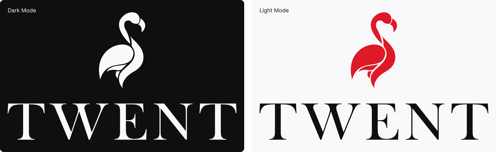

# ✨ Documento de Identidade da TWENT

## 1. Introdução

TWENT é uma marca fictícia criada para representar uma rede de lojas de relógios de alto padrão. Seu propósito é transmitir **sofisticação, exclusividade e modernidade**, refletindo uma identidade sólida tanto no mundo físico quanto no digital.

Mais do que vender relógios, a TWENT simboliza o encontro entre **tradição relojoeira** e **design contemporâneo**, criando uma marca que honra o passado enquanto projeta o futuro.

---

## 2. Ideação da Marca

O nome **TWENT** foi escolhido por sua **força e simplicidade**: curto, direto e memorável, ele transmite sofisticação e minimalismo, características essenciais de marcas premium. A marca atua no setor de **relógios de luxo**, posicionando-se como referência em alto padrão e exclusividade.

Sua proposta se diferencia ao oferecer uma rede de lojas físicas distribuídas ao redor do mundo. **Os produtos não podem ser adquiridos digitalmente**; o ambiente online funciona como vitrine, enquanto **a experiência de compra acontece apenas nas boutiques**, reforçando a aura de exclusividade.

A essência da TWENT está em seu **conceito híbrido**, que une o clássico e o moderno. A marca inspira-se nas tradições seculares da relojoaria, mas atualiza-se constantemente com produtos e experiências digitais que dialogam com as novas gerações. Esse equilíbrio garante **atemporalidade e inovação**, sem perder a sofisticação que a define.

---

## 3. História da Marca

A TWENT foi fundada em **Genebra, Suíça, em 1984**, pelo visionário relojoeiro **Adrien Lambert**, descendente de uma família tradicional no ofício da relojoaria. Desde jovem, Adrien cresceu imerso na atmosfera dos ateliês suíços, onde o silêncio era preenchido apenas pelo **tique-taque compassado** de peças minúsculas ganhando vida.

Apesar de sua sólida formação clássica, Adrien acreditava que a relojoaria deveria ir além da tradição: ela deveria **dialogar com o futuro**. O mundo dos anos 80 vivia uma transformação marcada pela ascensão da tecnologia digital, e muitos acreditavam que o relógio mecânico estava fadado ao esquecimento. Lambert, no entanto, enxergava nisso uma oportunidade única: criar uma marca capaz de **unir a arte centenária suíça ao espírito moderno de inovação**.

Assim nasceu a **TWENT**, cujo nome remete à **passagem do século XX para o XXI** — uma ponte entre tempos. O objetivo era claro: oferecer peças que não fossem apenas instrumentos de medição, mas **símbolos de estilo, precisão e herança cultural**.

A primeira boutique foi aberta na elegante **Rue du Rhône, em Genebra**, e logo se tornou um **ponto de encontro para colecionadores** e apreciadores de alta relojoaria. Cada modelo lançado pela TWENT carregava em si uma dualidade: **linhas clássicas**, inspiradas em relógios de bolso do século XIX, combinadas com **detalhes ousados e modernos**, refletindo a busca constante de Lambert por inovação sem perder raízes.

Com o tempo, a TWENT expandiu sua presença internacional, mantendo sempre a filosofia original: criar uma **experiência premium**, onde cada cliente não adquire apenas um relógio, mas participa de uma narrativa que conecta passado, presente e futuro.

Hoje, a TWENT representa o **equilíbrio raro** entre **tradição e modernidade**, mantendo viva a visão de Adrien Lambert: uma marca que não mede apenas o tempo, mas **o torna eterno**.

---

## 4. Identidade Visual

### Logotipo

O logotipo da TWENT traduz o **espírito híbrido da marca** e combina tradição com modernidade. Ele é composto por um símbolo abstrato e pela tipografia do nome. O símbolo, em **vermelho intenso** (`#DE1A26`), remete simultaneamente a uma **chama estilizada** e à **silhueta de um pinguim**. Essa dualidade sugere **energia, resiliência e sofisticação**, atributos centrais da identidade da TWENT. O vermelho destaca-se em meio à paleta neutra, transmitindo **paixão e ousadia**.

Já o nome **TWENT** aparece em **caixa alta**, utilizando uma fonte serifada clássica. Essa escolha reforça **autoridade, tradição e luxo**, enquanto o preto profundo (`#0F0F0F`) assegura **contraste e sobriedade** em qualquer aplicação.

A marca possui **variações horizontais e verticais**, além de ícones simplificados com o símbolo isolado, ideais para uso em aplicativos e redes sociais. Também existe uma versão alternativa com **fundo vermelho e símbolo em branco**, pensada para espaços reduzidos e aplicações digitais.

#### Versões do logotipo

---

## 5. Paleta de Cores

A paleta reflete **elegância e sobriedade**, transmitindo a seriedade da marca sem perder sofisticação:

-   **Branco:** `#F9F9FB` - Cor de fundo principal, trazendo **leveza e minimalismo**.

-   **Preto:** `#0F0F0F` - Representa **exclusividade, luxo e sofisticação**.

-   **Vermelho (Primário):** `#DE1A26` - Expressa **energia, luxo e diferenciação**.

---

## 6. Tipografia

-   **Fonte Principal (Sans):** Noto Sans Adlam - **Moderna, sofisticada e legível**, garantindo consistência em interfaces digitais.

-   **Fonte Serifada (Secundária):** Noto Serif - Usada em títulos e materiais institucionais, trazendo **a força do clássico**.

-   **Fonte Monoespaçada:** Roboto Mono - Aplicada em **tabelas e dados técnicos**.

---

## 7. Valores da Marca

-   **Exclusividade**
-   **Sofisticação**
-   **Experiência premium**
-   **Tradição e modernidade unidas**
-   **Respeito ao tempo e ao detalhe**

---

## 8. UI Design

A interface da TWENT adota uma estética minimalista, valorizando a clareza e a sofisticação. O branco (`#F9F9FB`) é usado como base predominante, transmitindo leveza, enquanto o preto (`#0F0F0F`) garante contraste e estrutura. O vermelho (`#DE1A26`) aparece de forma pontual em botões e elementos de destaque, reforçando a identidade da marca.

Na tipografia, a **Noto Sans** é aplicada como fonte principal, garantindo legibilidade e modernidade. A **Noto Serif** é usada em títulos para transmitir tradição, enquanto a **Roboto Mono** se aplica em elementos técnicos e numéricos.

No **dark mode**, a inversão de cores preserva a sofisticação: o preto passa a ser a base predominante, o branco assume papel de contraste nos textos, e o vermelho mantém sua função de destaque. Assim, a identidade visual permanece consistente, independentemente do tema utilizado.

A configuração completa do design system pode ser acessada no [Tweakcn](https://tweakcn.com/themes/cmfigea2y000k04kza3n73byh).
